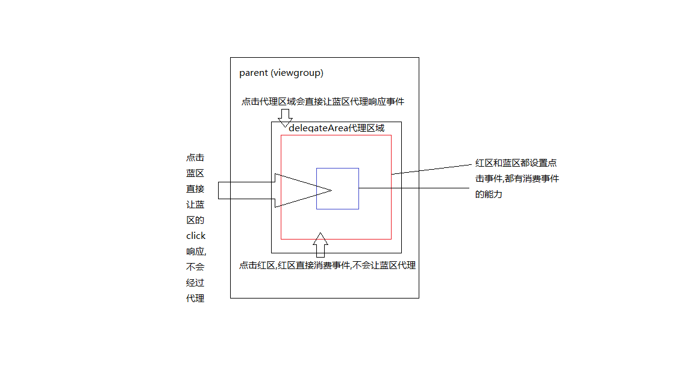

# TouchDelegate 触摸事件的代理

>这个类主要处理你需要一个view拥有比他实际尺寸更大的触摸面积的这类情况,这个类由view的父类使用,也就是说需要扩大触摸面积view的父布局来调用setTouchDelegate方法.
TouchDelegate方法的调用是在View里的onTouchEvent方法中被调用的,我们可以通过父类布局设置一个代理的区域和代理的控件,当我们点击这个区域的时候就会把区域的触摸事件交给对应的代理控件去处理.(注意:首先这个区域必须没有其他的控件会消费事件,否则其他控件会消费掉事件就无法发到代理控件)

示例代码

    public class MainActivity extends AppCompatActivity implements View.OnClickListener {
    
        private View green;
        private View blue;
        private View red;
        private RelativeLayout parent;
    
        @Override
        protected void onCreate(Bundle savedInstanceState) {
            super.onCreate(savedInstanceState);
            setContentView(R.layout.activity_main);
            red = findViewById(R.id.red);
            blue = findViewById(R.id.blue);
            green = findViewById(R.id.red);
            parent = (RelativeLayout) findViewById(R.id.rl_parent);
    
    
            //(必须在view测量绘制结束后使用该方法)
            new Handler().postDelayed(new Runnable() {
                @Override
                public void run() {
                    Rect rect = new Rect();
                    red.getHitRect(rect);
                    rect.left -= 200;
                    rect.top -= 200;
                    rect.right += 200;
                    rect.bottom += 200;
                    parent.setTouchDelegate(new TouchDelegate(rect, blue));
                }
            }, 500);
    
            findViewById(R.id.red).setOnClickListener(this);
            findViewById(R.id.blue).setOnClickListener(this);
            findViewById(R.id.green).setOnClickListener(this);
        }
    
        @Override
        public void onClick(View v) {
            switch (v.getId()) {
                case R.id.red:
                    Log.i("dianzhongle", "red is clicked");
                    break;
                case R.id.blue:
                    Log.i("dianzhongle", "blue is clicked");
                    break;
                case R.id.green:
                    Log.i("dianzhongle", "green is clicked");
                    break;
            }
        }
    }

## 示例代码效果图

为什么会造成上面的结果呢,因为前面我们知道TouchDelegate方法的调用是在View里的onTouchEvent方法中被调用的,**意味着事件只有在没有被消费的情况下会回传到父类布局去消费,这个时候会判断是否是在代理区域,如果是在代理区域交由代理控件消费,如果代理控件无法处理,才交由父类布局处理触摸事件**.如果事件被子类控件消费掉了,就无法再代理了.